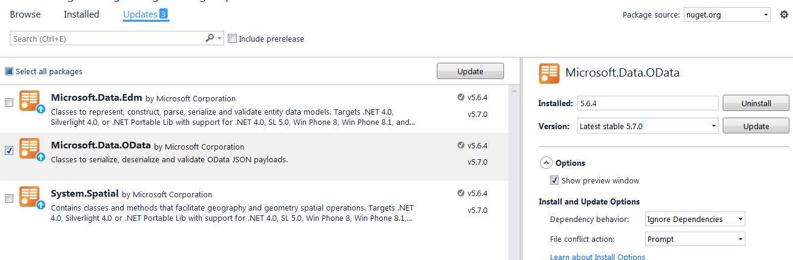

# NugetManagerUpdateTest

This is test project for Update error with Nuget manager v3.3.

When I try to update Nuget with Ignore Dependency and nuget has dependencies update fail with message "Available"

Screenshot

Package manager console output
***
>Attempting to gather dependencies information for multiple packages with respect to project 'NugetManagerUpdateTest', targeting '.NETFramework,Version=v4.5.2'
>Attempting to resolve dependencies for multiple packages
>Resolving actions install multiple packages
>available
***